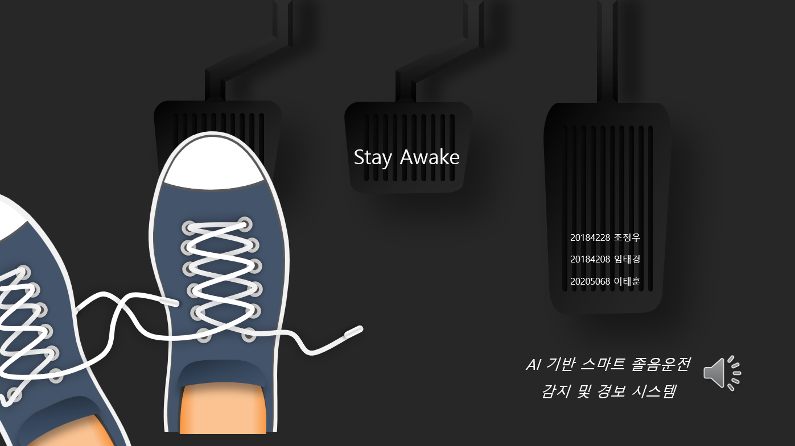
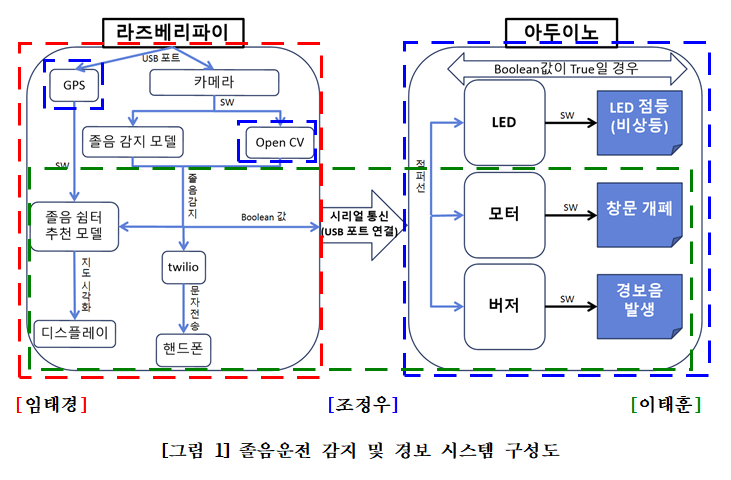
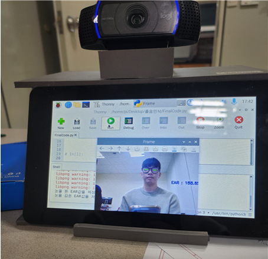
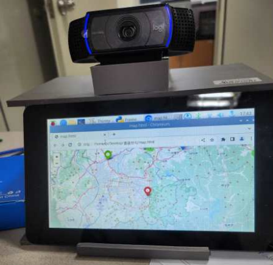
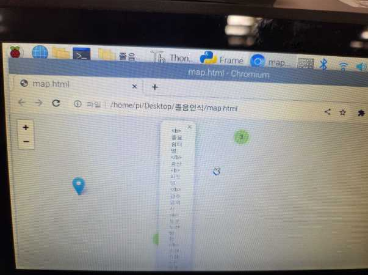
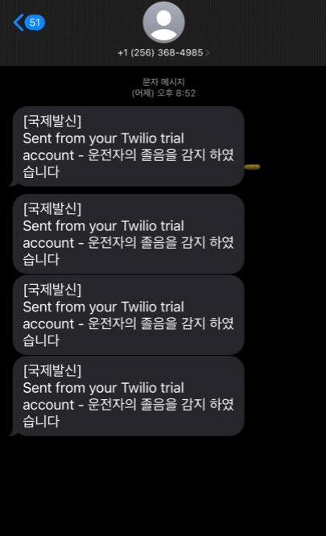
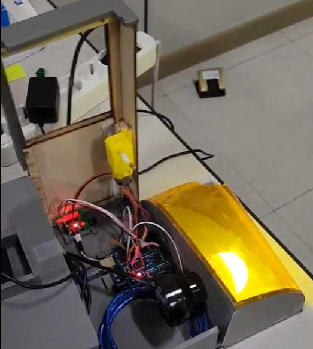

# AI기반 스마트 졸음 운전 감지 및 경보 시스템

 

## 1. 배경 & 목적

- 배경

    졸음운전은 교통사고의 주요 원인 중 하나로, 특히 장거리 운전이나 야간 운전 시 발생 빈도가 높습니다. 졸음운전으로 인한 사고는 운전자의 반응 속도를 감소시키고, 위험 상황에서 적절한 대처를 어렵게 만들어 심각한 인명 피해로 이어질 수 있습니다. 기존의 졸음운전 방지 시스템은 운전자의 주의력을 향상시키기 위해 주로 음성 알림이나 진동 등을 사용했으나, 이러한 시스템들은 졸음 상태를 정확히 감지하지 못하거나, 운전자가 이를 무시하는 경우가 많았습니다. 이러한 문제를 해결하기 위해 인공지능(AI) 기술을 활용한 스마트 졸음운전 감지 및 경보 시스템이 필요하게 되었습니다. 특히, 본 프로젝트에서는 운전자의 얼굴 인식과 행동 분석을 통해 졸음 상태를 실시간으로 감지하고, 경고를 제공하는 시스템을 개발하고자 하였습니다.

- 목적

     - 실시간 졸음 상태 감지 및 경고: 운전자의 눈 깜빡임, 고개 숙임 등의 행동을 분석하여 졸음 상태를 실시간으로 감지하고, 이를 운전자에게 즉각적으로 경고하여 사고를 예방합니다.
     - 안전한 운전 환경 제공: 졸음운전으로 인한 사고 위험을 최소화하여, 보다 안전한 운전 환경을 제공하고 교통사고 발생률을 줄이는 것을 목표로 합니다.
     - 효율적인 경보 시스템: 경보 시스템을 통해 운전자가 즉각적으로 반응할 수 있도록 하여, 졸음운전 발생 시 신속하게 대응할 수 있도록 지원합니다.

 

## 2. 주최/주관 & 팀원

- 주최/주관: 조선대학교 산학캡스톤디자인
- 팀원: 이태훈, 임태경, 조정우

 

## 3. 프로젝트 기간

- 2023.09. ~ 2023.12. (11주)

 

## 4. 프로젝트 소개

AI 기반 스마트 졸음운전 감지 및 경보 시스템은 운전 중 졸음을 감지하고, 경보를 발하여 사고를 예방하는 시스템입니다. 이 시스템은 졸음운전으로 인한 교통사고를 줄이기 위해 설계되었으며, 다양한 기술들을 통합하여 실시간으로 운전자의 상태를 모니터링하고 경고를 제공하는 기능을 포함하고 있습니다. 주요 구성 요소로는 라즈베리파이(Raspberry Pi), 아두이노(Arduino), 카메라 모듈, GPS 모듈, 서보모터 등이 사용되었습니다.

1. 사용된 주요 기술
 - 1.1 아두이노

    아두이노는 창문 개방, 경보음 발생, LED 점등 등 다양한 하드웨어 제어를 담당합니다. 아두이노와 라즈베리파이를 USB 포트를 통해 연결하고, 라즈베리파이에서 처리된 졸음 감지 신호를 받아 창문 개방 및 경보음 발생 등의 액션을 수행합니다.

 - 1.2 라즈베리파이

    라즈베리파이는 졸음 감지를 위한 메인 프로세서 역할을 합니다. 카메라 모듈을 통해 실시간으로 운전자의 얼굴을 인식하고, 딥러닝 모델을 통해 졸음 상태를 감지합니다. 라즈베리파이에서 졸음이 감지되면, 아두이노로 신호를 보내고, 동시에 졸음 쉼터 위치를 검색하여 운전자에게 가장 가까운 쉼터를 안내합니다. 이 과정에서 GPS 모듈을 활용하여 현재 위치를 기반으로 졸음 쉼터를 추천합니다.

 - 1.3 졸음 감지

    졸음 감지는 카메라 모듈과 dlib 라이브러리를 활용하여 운전자의 눈 상태를 실시간으로 분석합니다. 눈의 종횡비(EAR, Eye Aspect Ratio)를 계산하여 일정 시간 동안 낮은 값을 유지하면 졸음으로 판단합니다. 졸음이 감지되면, 경보음을 발생시키고, 창문을 자동으로 개방하여 운전자가 깨어날 수 있도록 합니다.

    

2. 주요 기능
 - 2.1 졸음 감지 및 경보

    시스템은 운전자의 눈을 실시간으로 모니터링하고, 졸음이 감지되면 경보음을 발생시키고, 창문을 개방합니다. 이와 동시에 LED를 점등하여 운전자에게 즉각적인 경고를 제공합니다.

    

 - 2.2 졸음 쉼터 안내

    GPS 모듈을 활용하여 현재 위치를 파악하고, 가장 가까운 졸음 쉼터를 추천합니다. 라즈베리파이는 이 정보를 실시간으로 분석하고, 운전자에게 쉼터의 위치를 지도 형식으로 제공합니다. Folium 라이브러리를 사용하여 지도를 시각화하고, 운전자가 쉽게 쉼터를 찾을 수 있도록 도와줍니다.

    

    

 - 2.3 문자 전송

    졸음이 감지되면, 미리 설정된 번호로 경고 문자를 전송하는 기능도 포함되어 있습니다. 이는 Twilio API를 활용하여 구현되었으며, 긴급 상황 시 운전자의 지인에게 경고 메시지를 보낼 수 있습니다.

    

    
3. 시연 및 결과

    이 시스템은 졸음 감지 및 경보, 창문 개방, 쉼터 안내 등 다양한 기능이 문제없이 작동함을 확인하였습니다. 라즈베리파이와 아두이노 간의 통신도 원활하게 이루어지며, 졸음 쉼터 추천 기능도 GPS 모듈을 활용해 정확하게 위치를 안내합니다. 최종적으로, 이 시스템은 운전 중 졸음으로 인한 사고를 효과적으로 예방할 수 있는 솔루션으로 자리 잡을 것입니다.

    

 

## 5. 프로젝트 담당 역할

- 얼굴 인식(졸음 인식) - 카메라

    OpenCV 라이브러리를 활용하여 실시간으로 사용자의 얼굴을 인식하고 졸음 여부를 판별하는 시스템을 구현했습니다. 얼굴 인식 기능은 운전자의 눈의 상태를 모니터링하여 눈의 종횡비(EAR, Eye Aspect Ratio)를 계산합니다. EAR 값이 일정 시간 동안 낮아지면 졸음 상태로 판단하고, 그 결과를 후속 시스템에 전달합니다. 이를 통해 운전 중 졸음을 감지하고, 즉각적인 경고를 제공하는 핵심 기능을 구현했습니다.

    주요 작업:
     - OpenCV를 이용한 실시간 얼굴 인식 및 졸음 감지 구현
     - 얼굴 랜드마크를 통해 눈의 위치를 추적하고, EAR 계산
     - 실시간 영상 처리 및 데이터 전송을 통해 졸음 여부 판단

- 졸음 쉼터 추천 - 데이터 기반 지도 시각화

    졸음이 감지되었을 때, 운전자에게 가장 가까운 졸음 쉼터를 추천하는 기능을 구현했습니다. 이 기능은 공공데이터 포털에서 제공된 졸음 쉼터 데이터를 활용하여 구현되었으며, Folium 라이브러리를 통해 지도 위에 시각화되었습니다. 운전자가 졸음 상태에 빠지면, 현재 위치에서 가장 가까운 쉼터를 찾아 안내함으로써 안전한 휴식을 취할 수 있도록 도와줍니다.

    주요 작업:
     - 전국 졸음 쉼터 데이터를 수집 및 전처리
     - Folium을 이용한 졸음 쉼터의 지도 시각화
     - 유클리디안 거리 계산을 통해 가장 가까운 졸음 쉼터 추천 기능 구현

 